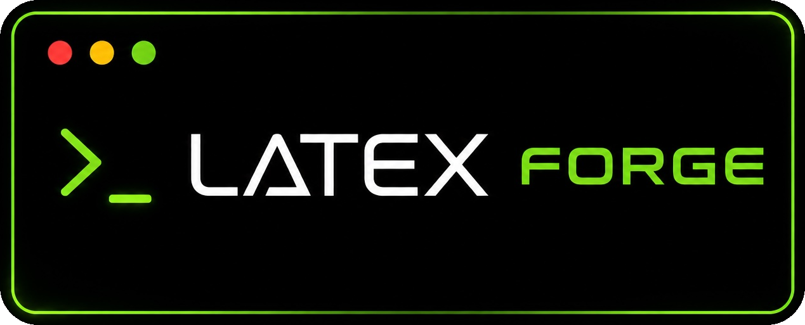
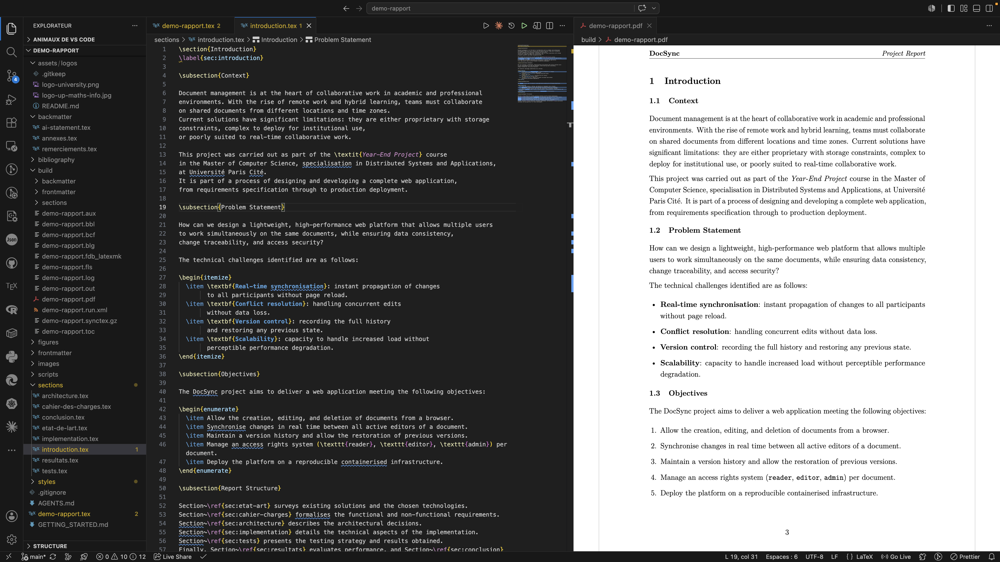

<p align="right"><b>English</b> | <a href="./README.fr.md">Français</a></p>

<p align="center">
  
</p>

<p align="center">
  <b>Write your document. Save. Your PDF appears. That's it.</b>
</p>

<p align="center">
  <a href="https://pypi.org/project/latex-forge/"></a>
  <a href="https://github.com/thmsgo18/latex-forge/actions/workflows/ci.yml"></a>
  <a href="https://pypi.org/project/latex-forge/"></a>
  <a href="LICENSE"></a>
</p>

<p align="center">
  <a href="#quick-start">Quick start</a> •
  <a href="#templates">Templates</a> •
  <a href="#your-profile">Profile</a> •
  <a href="#compile-from-the-terminal">Build</a> •
  <a href="#need-help">Help</a> •
  <a href="#command-reference">Commands</a> •
  <a href="#related-projects">VS Code extension</a>
</p>

---

<p align="center">
  
</p>

## What is LaTeX Forge?

You need to hand in a report, a CV, or a paper in LaTeX, and you'd rather spend your time **writing** than fighting with packages, compilers, and configuration.

LaTeX Forge is a small tool you install once. One command then creates a complete, ready-to-write document project: the folder structure, the styles, the bibliography setup, and a pre-configured VS Code workspace. Open it, type, save: the PDF rebuilds automatically in a side panel.

**No LaTeX knowledge required to get started.** And if you already live in a terminal, everything is scriptable.

## Quick start

```bash
# 1. install (one time)
pipx install latex-forge

# 2. check your machine and install what's missing (LaTeX, VS Code extensions)
latex-forge setup

# 3. create your first project
latex-forge create --name my-report --template project-report-en

# 4. open it and start writing
code my-report
```

<details>
<summary><i>What is pipx? (click if step 1 fails)</i></summary>

`pipx` installs Python command-line tools cleanly. If it's missing:

- **macOS**: `brew install pipx && pipx ensurepath`
- **Windows**: `py -m pip install --user pipx && py -m pipx ensurepath`
- **Linux**: `sudo apt install pipx && pipx ensurepath` (or see [pipx.pypa.io](https://pipx.pypa.io))

Then open a new terminal and run step 1 again. Python 3.10+ is required.
</details>

## Features

- **One-command projects**: complete folder structure, embedded styles, zero external dependencies
- **Live PDF preview**: generated projects are pre-wired for [LaTeX Workshop](https://marketplace.visualstudio.com/items?itemName=James-Yu.latex-workshop): save in VS Code, see the PDF
- **Terminal compilation**: `latex-forge build` and `latex-forge watch` work without any editor, and missing packages are installed automatically
- **80+ templates**: CVs, theses, papers, posters, slides… installable from the [gallery](https://github.com/thmsgo18/latex-forge-gallery) in one command, plus your own with `--engine`
- **Your profile, auto-filled**: set your name, email, and university once; every new project starts personalized
- **Git-ready**: `latex-forge create --git` initializes a repository with the first commit
- **Submission-ready exports**: `latex-forge export` bundles your sources and PDF into a clean ZIP
- **Environment doctor**: `latex-forge setup` installs the toolchain per OS; `latex-forge diagnose` tells you what's wrong
- **AI-friendly**: every project ships an `AGENTS.md` briefing so any AI assistant can contribute immediately
- **Cross-platform**: macOS, Linux, Windows

## How it feels

<p align="center">
  
</p>

Write on one side. See your document on the other. Every save refreshes the result.

## Templates

Six templates are built in:

| Template | Language | Description |
|---|---|---|
| `blank` | English | Minimal document: title, one section, ready to grow |
| `project-report-en` | English | ISO/IEEE project report: requirements, architecture, testing, bibliography |
| `project-report-fr` | French | AFNOR/ISO project report: cahier des charges, architecture, tests, bibliographie |
| `research` | English | Two-column research article: related work, methodology, experiments, bibliography |
| `cv-en` | English | CV / résumé: education, experience, projects, skills |
| `cv-fr` | French | CV: formation, expérience, projets, compétences |

```bash
latex-forge list-templates
```

### The gallery (80+ more)

Browse the [**template gallery**](https://thmsgo18.github.io/latex-forge-gallery/) with previews, then install any template in one command:

<p align="center">
  <a href="https://thmsgo18.github.io/latex-forge-gallery/">
    
    
    
    
  </a>
</p>

```bash
# install a template from the gallery
latex-forge template install https://github.com/thmsgo18/latex-forge-gallery/tree/main/templates/thesis/clean-thesis

# create a project from it
latex-forge create --template clean-thesis --name my-thesis

# manage installed templates
latex-forge template list
latex-forge template update          # pull new versions from the gallery
latex-forge template remove clean-thesis
```

You can also install **your own templates** from any GitHub repo, ZIP file, or local folder. The only requirement is a `main.tex` at the root:

```bash
latex-forge template install https://github.com/someone/their-template
latex-forge template install ~/my-templates/lab-notes --name lab-notes

# declare the LaTeX engine if the template doesn't already (pdflatex/xelatex/lualatex)
latex-forge template install https://github.com/someone/their-template --engine xelatex
```

See [TEMPLATE_COMPATIBILITY.md](TEMPLATE_COMPATIBILITY.md) for how to get profile auto-fill (name, email, university…) working with your own templates too.

> Prefer clicking to typing? The [VS Code extension](https://github.com/thmsgo18/latex-forge-vscode) has a built-in gallery browser with previews and one-click install.

## Your profile

Tell LaTeX Forge who you are **once**, and every new project is pre-filled with your name, email, university, and more:

```bash
latex-forge profile set      # interactive: name, email, phone, university…
latex-forge profile show
latex-forge profile clear
```

Works with the built-in templates and the gallery ones (CVs get your contact details, reports get your university and supervisor).

## Compile from the terminal

No VS Code? No problem.

<p align="center">
  
</p>

```bash
latex-forge build            # compile once → build/<name>.pdf
latex-forge build --clean    # wipe build artifacts first
latex-forge watch            # recompile on every save (Ctrl+C to stop)
```

The right LaTeX engine is detected from the project itself: nothing to configure.

## Usage

### Interactive mode

```
$ latex-forge create

Project name: my-report
Available templates:
  1. blank
  2. cv-en
  3. cv-fr
  4. project-report-en
  5. project-report-fr
  6. research
Choose a template [1-6]: 4
Create project in [/Users/alice/Desktop]:

Project created: /Users/alice/Desktop/my-report
Open project in VS Code? [y/N]
```

### With flags

```bash
latex-forge create --name my-report --template project-report-en
latex-forge create --name my-paper --template research --output ~/Desktop
```

### Rename a project

```bash
latex-forge rename old-name new-name   # from the parent directory
latex-forge rename new-name            # from inside the project
```

### Configuration

```toml
# ~/.latex-forge.toml
default_template = "project-report-en"
default_output_dir = "~/Documents/projects"
```

| Key | Description |
|---|---|
| `default_template` | Template used when `--template` is omitted |
| `default_output_dir` | Output directory used when `--output` is omitted |

### Shell completion

Tab completion for commands, flags, and template names for **bash** (`~/.bashrc`) or **zsh** (`~/.zshrc`):

```bash
eval "$(latex-forge completion)"
```

## Filling in your project

Open `frontmatter/metadata.tex` to set the title, authors, and course:

```tex
\newcommand{\reporttitle}{Audio Fingerprinting Study}
\newcommand{\coursename}{Machine Learning}

\resetauthors
\addauthor{Alice Martin}{}
\addauthor{Bob Durand}{}
```

Save the main `.tex` file: the PDF rebuilds instantly in VS Code (or run `latex-forge build`).

## Generated project structure

```
my-project/
├── my-project.tex            ← main file (named after the project)
├── frontmatter/
│   ├── metadata.tex          ← title, authors, course (start here)
│   └── toc.tex
├── sections/                 ← one .tex file per section
├── backmatter/               ← acknowledgements, appendices
├── bibliography/
│   └── references.bib
├── figures/  images/  assets/logos/
├── styles/packages/          ← embedded styles, no external dependency
├── .vscode/                  ← pre-configured for live PDF preview
├── GETTING_STARTED.md        ← guide for you
├── AGENTS.md                 ← briefing for AI assistants
└── .gitignore
```

The project is fully self-contained: it compiles, shares, and versions independently, with no dependency on this repository. Every project also ships `AGENTS.md`, a briefing that lets any AI assistant open the project cold and contribute correctly.

## Need help?

Start with the doctor, which checks everything and tells you what to fix:

```bash
latex-forge diagnose
```

| Problem | Fix |
|---|---|
| `latex-forge: command not found` | Open a new terminal, or run `pipx ensurepath` |
| Nothing compiles / no PDF | `latex-forge setup --install-tex` installs LaTeX for your OS |
| `Package X not found` | `tlmgr install X` (TeX Live); MiKTeX installs it automatically |
| Compilation stuck | `latex-forge build --clean`, then try again |
| Something else | [Open an issue](https://github.com/thmsgo18/latex-forge/issues) with the output of `latex-forge diagnose` |

## Command reference

| Command | Description |
|---|---|
| `latex-forge create` | Create a project (interactive) |
| `latex-forge create --name N --template T --output DIR [--git]` | Create with explicit arguments, optionally with `git init` |
| `latex-forge build [DIR] [--clean] [--verbose]` | Compile to PDF with latexmk (auto-installs missing packages via tlmgr) |
| `latex-forge watch [DIR]` | Recompile on every save |
| `latex-forge export [DIR] [--output FILE]` | Bundle sources + PDF into a clean ZIP for submission |
| `latex-forge rename [OLD] NEW` | Rename a project (folder + main file + artifacts) |
| `latex-forge list-templates` | List available templates |
| `latex-forge template install SOURCE [--name N] [--force] [--engine E]` | Install a template (GitHub URL, ZIP, local path) |
| `latex-forge template list [--json]` | List built-in and installed templates |
| `latex-forge template update [NAME] [--json]` | Update installed gallery templates |
| `latex-forge template remove NAME` | Remove an installed template |
| `latex-forge profile set / show / clear` | Manage your auto-fill profile |
| `latex-forge setup [--check-only] [--install-tex]` | Check / set up the environment |
| `latex-forge diagnose [--json]` | Environment health check |
| `latex-forge completion [--shell SHELL]` | Print shell completion code |
| `latex-forge --version` | Show version |

## Versioning your documents

Each project is self-contained, so you can version it independently:

```bash
cd my-project
git init && git add . && git commit -m "Initial report"
```

## Contributing

See [CONTRIBUTING.md](CONTRIBUTING.md). The demo GIFs are generated with [vhs](https://github.com/charmbracelet/vhs): `./docs/demo/record.sh`.

## Related projects

| Project | What it adds |
|---|---|
| [**latex-forge-vscode**](https://github.com/thmsgo18/latex-forge-vscode) | Do everything from VS Code: create projects, browse the gallery with previews, one-click template install (no terminal needed) |
| [**latex-forge-gallery**](https://github.com/thmsgo18/latex-forge-gallery) | The curated template gallery (80+ templates) and its [browsable website](https://thmsgo18.github.io/latex-forge-gallery/) |
| [**latex-forge-skill**](https://github.com/thmsgo18/latex-forge-skill) | A Claude skill that drives the whole workflow from a conversation: scaffold, write, build and export documents |

## Author

Made by [thmsgo18](https://github.com/thmsgo18)
